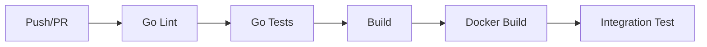

# PetMatch CI/CD & Testing

## 🧪 Go テスト戦略

### テスト種別

#### 1. ユニットテスト
- **対象**: 各サービスの個別機能
- **実行方法**: `make test-unit` または `make test-pet`
- **カバレッジ**: 各ハンドラー、サービス、ストレージ層

#### 2. 統合テスト
- **対象**: サービス間連携
- **実行方法**: `make test-integration`
- **環境**: Redis + PostgreSQL

#### 3. ビルドテスト
- **対象**: `*_test.go`ファイルが本番ビルドから除外されることを確認
- **実行方法**: `make test-build`

### CI/CD パイプライン



## 🔧 ローカル開発

### 前提条件
- Go 1.21+
- Docker
- Minikube
- kubectl

### 開発フロー

1. **環境セットアップ**
   ```bash
   make setup-auto
   make start
   ```

2. **テスト実行**
   ```bash
   # 全テスト
   make test
   
   # 特定サービス
   make test-pet
   make test-auth
   
   # カバレッジ
   make test-coverage
   ```

3. **コードリント**
   ```bash
   make lint
   make fix
   ```

## 📊 テストカバレッジ

### 目標
- **ユニットテスト**: 80%以上
- **統合テスト**: 主要フロー100%
- **エンドツーエンド**: 主要ユースケース

### レポート生成
```bash
make test-coverage
open coverage/pet-service.html
```

## 🚀 CI環境

### GitHub Actions

#### ジョブ構成

1. **golang-lint**: Go コードの静的解析
2. **golang-test**: 各サービスのユニットテスト
3. **golang-benchmark**: パフォーマンステスト
4. **golang-integration**: 統合テスト
5. **makefile-targets**: Makefileターゲットの動作確認
6. **security-scan**: セキュリティスキャン

#### 並列実行
```yaml
strategy:
  matrix:
    service:
      - pet-service
      - auth-service
      - user-service
      - match-service
      - chat-service
      - api-gateway
```

### 環境変数

#### テスト環境
```bash
GO_ENV=test
REDIS_HOST=localhost
REDIS_PORT=6379
POSTGRES_HOST=localhost
POSTGRES_PORT=5432
```

#### CI環境
```bash
CI=true
GITHUB_ACTIONS=true
```

## 🛡️ 品質保証

### 静的解析
- **golangci-lint**: コード品質チェック
- **gosec**: セキュリティ脆弱性スキャン

### テストデータ
- **モック**: redismock for Redis
- **フィクスチャ**: JSON形式のテストデータ
- **ファクトリー**: テストオブジェクト生成

### エラーハンドリング
- nil pointer deference対策
- goroutine安全性
- リソースリーク防止

## 📈 メトリクス

### 測定項目
- **テスト実行時間**
- **カバレッジ率**
- **失敗率**
- **ビルド時間**

### ベンチマーク
```bash
make test-bench
```

## 🔧 トラブルシューティング

### よくある問題

#### Redis接続エラー
```bash
# 解決方法
make start
kubectl port-forward service/redis 6379:6379 -n petmatch
```

#### テストファイル競合
```bash
# nil pointer dereferenceの場合
export GO_ENV=test
make test-pet
```

#### Docker イメージビルド失敗
```bash
eval $(minikube docker-env)
make build-pet
```

## 📝 コントリビューション

### テスト追加手順

1. **テストファイル作成**
   ```bash
   # handlers/new_feature_test.go
   package handlers
   
   import (
       "testing"
       "github.com/stretchr/testify/assert"
   )
   
   func TestNewFeature(t *testing.T) {
       // テスト実装
   }
   ```

2. **テスト実行**
   ```bash
   make test-pet
   ```

3. **カバレッジ確認**
   ```bash
   make test-coverage
   ```

### プルリクエスト要件

- [ ] 全テストがパス
- [ ] カバレッジ80%以上
- [ ] Lintエラーなし
- [ ] セキュリティスキャンパス

## 🔗 関連リンク

- [Go Testing](https://golang.org/pkg/testing/)
- [Testify](https://github.com/stretchr/testify)
- [golangci-lint](https://golangci-lint.run/)
- [redismock](https://github.com/go-redis/redismock)
